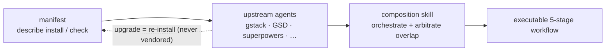

## 问题所在

AI 编程脚手架 —— ECC、Superpowers、GSD、gstack —— 各自以独立的 npm 包或 git 仓库形式发布。手动将它们整合在一起很脆弱：你需要 fork 上游代码、在本地打补丁，然后眼睁睁看着它随着上游发布新版本而腐化。

传统的解决方案是 vendoring：把上游代码复制到你的仓库并自行维护。这在上游发布重大改进之前都能用，但之后你就被困在陈旧的 fork 上，很难合并新变更。手动保持数十个脚手架组件同步根本不可持续。

## harnessed 的方法

harnessed 从不复制上游代码。每个脚手架包提供一份**清单** —— 一个类型化的 YAML 文件，描述如何安装该包、它暴露了哪些能力，以及如何与其他组件集成。

运行时，harnessed 读取这些清单、验证兼容性，并通过装配 skills 编排上游工具。你始终运行的是官方上游二进制文件 —— harnessed 只负责协调各组件之间的交接。

装配而非 vendor —— manifest 描述，composition skill 编排：



清单示例（简化版）：

```yaml
name: my-pack
version: 1.0.0
description: 为 harnessed 添加 OAuth2 工作流
install:
  - npm: superpowers
  - git: https://github.com/example/skill-pack-oauth
capability:
  skills:
    - brainstorming
    - tdd
  workflows:
    - discuss
    - plan
```

## 优势

**始终使用最新上游。** 当 Superpowers 发布新版本时，重新运行 `harnessed install` 即可立即获取。无需手动合并，没有陈旧的 fork。

**经过验证的装配。** `harnessed setup` 在安装前检查清单兼容性。冲突的能力声明会以错误形式暴露，而不是运行时惊喜。

**编写自己的 pack。** 清单 schema 发布在 repo 的 `schemas/manifest.v1.schema.json`（把 YAML language server 指向它即可内联验证）。将你的清单指向任何可安装的上游（npm 包、git 仓库、自定义 skill），harnessed 会将其视为一等可装配单元。

**统一入口点。** 用户面对 `/discuss`、`/plan`、`/task`、`/verify`，无需学习每个上游的术语。装配 skill 负责在每个阶段路由到正确的上游工具。

## 装配 skills 的工作原理

自 v4.0 起，harnessed 是 **orchestration brain + prompt library**（决策大脑 + prompt 库），不再是执行引擎。它不在自身进程内 spawn 工作流 —— 而是由 slash 命令体（`harnessed setup` 生成）指挥 Claude Code main session 去 spawn **CC-native subagent**，由三个秒级纯函数 CLI 驱动。当你运行 `/discuss` 时：

1. **Gate** —— `harnessed gates discuss --task "<spec>"` 返回三个讨论关卡哪些触发（战略 / 阶段 / 子任务），以及是否升级到 Agent Teams。
2. **Prompt** —— 对每个触发的关卡，`harnessed prompt <sub> --json` 输出 spawn-ready prompt（role 主体 + checklist + 已应用 disciplines）。
3. **Spawn** —— main session 用原生 `Task` spawn（外层套 ralph-loop），把任何 `STATUS: NEEDS_CLARIFICATION` 通过 `AskUserQuestion` 回流给你。
4. **Checkpoint** —— `harnessed checkpoint complete <sub>` 把进度记录到 `.planning/`，使流程能在 compaction 后存活。

harnessed 贡献决策（gate 路由、prompt 生成、进度 ledger）；实际的 spawn、Agent Teams 协调、澄清往返都由 main session 用 Claude Code 原生工具执行。（`harnessed run` 保留旧的进程内 spawn，仅用于 CI/headless。）

这正是 harnessed 的 28 个工作流能够同时装配 ECC、Superpowers、GSD 和 gstack 的原因 —— 装配层抽象了各组件之间的接缝。

完整的 28 个工作流及其上游依赖，请参阅[工作流参考](/zh-hans/docs/reference/workflows/)。
