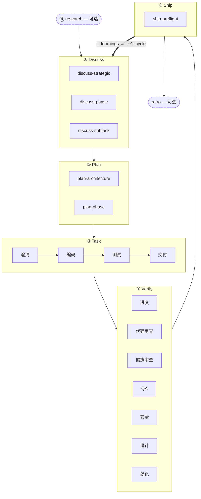

五阶段节奏是 harnessed 的核心方法论：每个功能、bug 修复或重构都按相同的五个阶段依次推进 —— **Discuss → Plan → Task → Verify → Ship** —— 由自动的 **Learn** 回环闭合。两个伴生阶段（Research、Retro）分别位于主循环两端。

## 阶段

| # | 阶段 | 斜杠命令 | 模式 |
|---|------|----------|------|
| 0 | **Research** | `/research` | 可选 —— 当理解不清晰时触发 |
| 1 | **Discuss** | `/discuss` | 必须 |
| 2 | **Plan** | `/plan` | 必须 |
| 3 | **Task** | `/task` | 必须 |
| 4 | **Verify** | `/verify` | 必须 |
| 5 | **Ship** | `/ship` | 显式 —— 发布阶段（用户触发） |
| — | **Retro** | `/retro` | `/auto` 中强制，单独调用可选 |

**学习是自动的，不是一个阶段。** 每个完成的 workflow 把其 failure/loop/reject 信号追加到 `.planning/LEARNINGS.md`；inject hook 把相关 learnings 注入下个 session。这是 always-on 的，**不**依赖可选的 Retro。

### Research（可选）

通过 Tavily、Exa 和 ctx7 进行多源调研。在 `/auto` 中当你回答"否"（不清楚需求）时触发，或直接调用 `/research`。输出写入 `.planning/` 下的 `research-notes.md`。

### Discuss —— 三层关卡

`/discuss` 独立评估三个关卡，仅运行触发的那些：

- **战略层**（`discuss-strategic`）：新功能、新 milestone、新产品方向 → gstack `/office-hours` + `/plan-ceo-review`。持久化 `findings.md`。
- **阶段层**（`discuss-phase`）：≥2 个开放的实现决策，跨模块数据流不清晰 → GSD `gsd-discuss-phase`。持久化 `findings.md` + `knowledge.md`。
- **子任务层**（`discuss-subtask`）：≥2 种不同方案的核心算法 / API contract → Superpowers brainstorming。短暂，不持久化。

每个关卡在触发和跳过时都会透明声明。

### Plan —— 架构审查 + 持久化

`/plan` 按顺序执行两步：

1. **架构审查**（条件触发）—— 复杂架构触发 gstack `/plan-eng-review`，在持久化前锁定设计
2. **阶段计划** —— GSD `gsd-plan-phase` + planning-with-files 生成 `task_plan.md`，包含精确文件路径、验收标准和依赖顺序

### Task —— 子任务循环

`/task` 严格按顺序对每个子任务执行四步：

1. **澄清** —— 验证规格，暴露歧义，核对 `task_plan.md`
2. **编码** —— karpathy 原则：最小可行改动，外科手术式编辑，不扩大范围
3. **测试** —— 核心逻辑 TDD 红灯 → 绿灯 → 重构；CRUD / 明显实现可选
4. **交付** —— `ralph-loop` 包装器确保逐字输出 `COMPLETE` 后才推进

### Verify —— 7 项条件子检查

`/verify` 根据变更内容派发子检查。始终运行：`verify-progress`（UAT + 状态同步）、`verify-code-review`（多 agent 并行）、`verify-simplify`（最终清理）。条件运行：偏执审查、QA、安全、设计、multispec。

### Ship —— 发布阶段

`/ship` 是第 5 个阶段，在 Verify 之后。它先跑 `harnessed release-preflight`（只读发布就绪门 —— `CHANGELOG [Unreleased]`/version/git-clean/tag-absent），再把 PR + deploy 委派给 gstack `/ship`。**deploy 边界 = tag-ready**：本阶段不 push、不 publish、不创建 tag —— 实际 `npm publish` + GitHub release 由 `publish.yml` CI 在 tag push 时执行（需显式批准）。"PR ready ≠ release ready"。

### Retro

gstack `/retro` 沉淀里程碑经验教训、决策记录和意外发现。在 `/auto` 中强制运行。可在任意里程碑结束时单独调用。（与上面 always-on 的 Learn 回环不同。）

## 流程图



## `/auto` 与单独阶段命令

`/auto` 自动串联核心开发阶段（research 条件 → discuss → plan → task → verify → retro）。**Ship 是显式的** —— `/auto` 不自动发版；里程碑准备好切版时你自己跑 `/ship`。单独的阶段命令让你可以从任意阶段切入：

```
/discuss "添加限速中间件"     # 仅运行 discuss
/plan "限速中间件"            # 仅运行 plan（假设 discuss 已完成）
/task "实现中间件"            # 仅运行 task
/verify "限速中间件功能"      # 仅运行 verify
/ship                        # 仅运行 ship（release-preflight → tag-ready）
```

跨*多个* phase 时，`harnessed advance` 从 `.planning/` 磁盘状态派生下一个 phase 并打印该跑的命令 —— 于是一个 driver loop 可以 hands-free 串联多个 phase（`while harnessed advance --json; do : ; done`），当更早的 phase 未完成时在 advance-gate 处停下。详见 [CLI 参考](../../reference/cli/) 的 `harnessed advance` 条目。

外科手术式子工作流调用完全跳过主控：

```
/discuss-phase "..."        # 仅运行阶段层澄清
/plan-architecture "..."    # 仅运行架构审查
/verify-paranoid "..."      # 仅运行偏执工程师检查
```

架构决策详见 [ADR 0030](https://github.com/easyinplay/harnessed/blob/main/docs/adr/0030-namespace-policy.md)、0031、0032（命名空间设计决策）。
