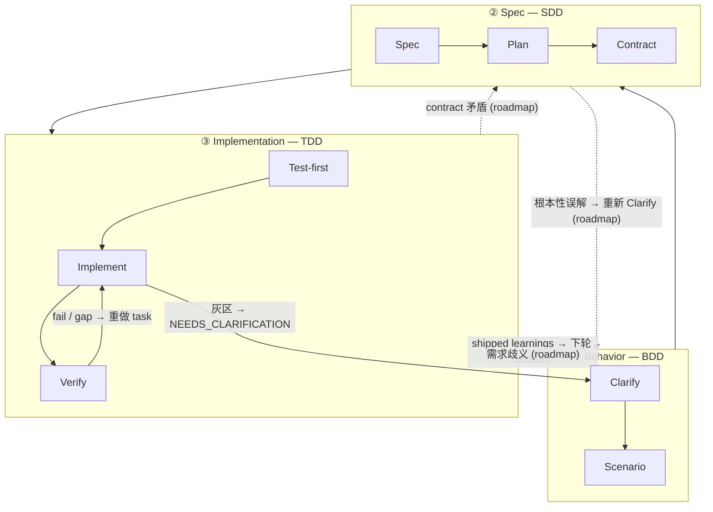

三层栈是 harnessed 关于「节奏*为什么*长这样」的理论。它不是 harnessed 自创的 —— 它是软件工程公认的 **BDD → SDD → TDD** 嵌套：三个嵌套反馈回环，各自回答一个不同的问题。harnessed 的贡献是把开源生态**组合**进每个 loop —— 而由于上游组件*部分交集*，仲裁这种交集正是装配编排器的本职工作。

## 三个回环

| 层 | Loop | 回答的问题 | 由哪些组件组合（彼此交集） |
|----|------|-----------|----------------------------|
| **① Behavior** | BDD | 做*什么*，以及怎样算做完 | gstack `/office-hours` governance · GSD discuss · superpowers brainstorming → acceptance criteria |
| **② Spec** | SDD | *怎样*组织结构 | GSD plan-phase → requirements / design / tasks · contracts（Spec Kit / ECC patterns） |
| **③ Implementation** | TDD | 它是否真的能*跑通* | superpowers TDD red-green · subagent execution · GSD verify-work · ralph-loop completion |

**loop 是嵌套的镜头（nested lenses），不是阶段。** Cucumber 推广了 BDD-outer + TDD-inner 双环：一个 failing scenario 打开外环，你通过多个内层 red-green TDD 循环把它驱动到绿。GenAI 时代加了一个中间环 —— Behavior 与 Implementation 之间显式的 SDD **spec** 环，因为 agent 需要一个 frozen contract 来执行。于是构成上面的**三层回环（triple-loop）**。

## 节点级展开

每个 loop 拆成若干节点，每个节点都标出它由哪个（些）开源组件组合而成。

### ① Behavior (BDD)

| 节点 | 作用 | 由哪些组件组合 |
|------|------|----------------|
| **Clarify** | 锁定*做什么* + 暴露歧义 | gstack `/office-hours` + GSD discuss + superpowers brainstorming |
| **Scenario** | 把意图转成 acceptance criteria | GSD phase success criteria |

外环在 scenario 的 acceptance criteria 写出来之前一直敞开。「做完」的定义在这里确定 —— 早于任何结构或代码。

### ② Spec (SDD)

| 节点 | 作用 | 由哪些组件组合 |
|------|------|----------------|
| **Spec** | requirements + design | GSD plan-phase + Spec Kit 三件套（requirements / design / tasks） |
| **Plan** | tasks + 依赖 DAG | GSD `PLAN.md` + ECC 分解 |
| **Contract** | 接口 frozen | contract 惯例 |

中间环把「做什么」转换成可执行的结构。它的退出条件是一个 **frozen contract** —— implementation 环将据此编写测试的接口。

### ③ Implementation (TDD)

| 节点 | 作用 | 由哪些组件组合 |
|------|------|----------------|
| **Test-first** | failing test（red gate） | superpowers TDD |
| **Implement** | 驱动到 green | subagent execution |
| **Verify** | refactor + 逐任务完成 | GSD verify-work + ralph-loop completion |

内环就是经典的 red → green → refactor 循环，每个 task 跑一遍，直到所有 contract 都被满足。

### Cross-cutting

两个关注点位于任何单一 loop 之外：

| 关注点 | 作用 | 由哪些组件组合 |
|--------|------|----------------|
| **Review** | 质量 + 安全关卡 | gstack `/review` + `/cso` |
| **Ship** | 发布就绪 + 交付 | `release-preflight` + gstack `/ship` |

另有两个 **discipline** 贯穿*每一*层：

- **karpathy principles** —— *how* to code：最小可行改动、外科手术式编辑、simplicity first。
- **mattpocock moves** —— 按需召唤的工具（`/zoom-out`、`/diagnose`、`/grill-with-docs`），看场景取用。

## 回转（GoBack）

flow 默认是 outer → inner。**harnessed 是这个 triple-loop 的 linear-cadence 实现 —— 完整的 routed graph 是它的演进方向。** 这些 loop 仍是反馈回环，但今天只有部分回转边真正 ship；更细粒度的、按环路由的结构化回转属于 roadmap。下图把已 ship 的边画成实线，roadmap 的边画成虚线并标 `(roadmap)`。

### 今天已 ship

当前 linear cadence 里有三条 live 的回转边：

- **Verify → Task** —— 失败的检查或未满足的 gap 把失败的工作打回 implementation 环重做。
- **灰区 → 澄清** —— subagent 撞到歧义时返回 `STATUS: NEEDS_CLARIFICATION`；run 暂停、澄清、再继续。
- **Learnings → 下轮 Discuss** —— 每个 shipped cycle 把 failure/loop/reject 信号追加下来，喂回下一轮的 Behavior 环（always-on 的 learn loop）。

### Roadmap（尚未 ship）

更细粒度的结构化回转 —— 把 gap *直接*路由到拥有答案的那个环 —— 是演进方向，而非当前行为：

- **contract 矛盾**（implementation 无法满足一个 frozen 接口）→ 路由回 **Spec**。
- **需求歧义**（contract 内部自洽，但 behavior 本身欠规约）→ 路由回 **Behavior**。
- **根本性误解**（整个结构瞄准了错误的结果）→ 重新打开 Behavior 的 **Clarify**。

今天这些 gap 通过上面三条已 ship 的边浮现（通常是 Verify → Task 加上人工澄清），而不是自动的按环路由。装配编排器的近期价值在于：当不同上游组件各自拥有不同的环时，保持 linear cadence 彼此一致；routed graph 是它前进的方向。

## 组件交集 —— 这正是重点

同一个上游工具会出现在不止一个 loop 里。这种交集不是冗余，而是装配编排器要仲裁的界面：

- **GSD** 是 **backbone** —— 贯穿全部三个环（discuss → plan → verify）。
- **gstack** 横跨 **Behavior + Review**。
- **superpowers** 横跨 **Behavior**（brainstorm）+ **Implementation**（TDD）。

没有仲裁，这些交集会重复触发或互相矛盾。装配层把每个环路由到正确的上游工具，并解决接缝。

## 理论 vs. runtime

三层栈是*理论*。[5 阶段节奏](/zh-hans/docs/concepts/four-stage-cadence/) 是这套理论在命令行的运行方式：

| Loop（理论） | runtime 阶段 |
|--------------|--------------|
| ① Behavior | **Discuss** |
| ② Spec | **Plan** |
| ③ Implementation | **Build**（Task） |
| Cross-cutting | **Verify + Ship**（evidence gate） |

关于上游工具*如何*在不 fork 的前提下拼接，参阅 [装配主义，而非 vendoring](/zh-hans/docs/concepts/composition/)。
