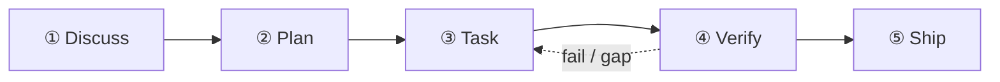

本教程通过一个真实示例，逐步演示五阶段节奏：**"给我们的 Express API 添加限速中间件 —— 每 IP 每分钟 100 次请求，Redis 后端。"**

你的第一次 `/auto` 会端到端走完五个 stage：



## 阶段一 — Discuss

```
/discuss "给我们的 Express API 添加限速中间件 —— 每 IP 每分钟 100 次请求，Redis 后端"
```

`/discuss` 并行评估三个澄清关卡，仅运行触发的那些：

- **战略关卡**（`discuss-strategic`）：这是新功能还是对现有基础设施的改造？是否影响产品定位？对于限速中间件，这个关卡通常会触发快速的治理检查。
- **阶段关卡**（`discuss-phase`）：是否有 ≥2 个开放的实现决策？（Redis 还是内存存储？按路由还是全局？）该关卡负责澄清并将发现持久化到 `findings.md`。
- **子任务关卡**（`discuss-subtask`）：是否有 ≥2 种不同实现方案的子任务？核心算法设计会进行快速 brainstorming。

**输出物**：`.planning/PHASE-N/` 下的 `findings.md` 和 `knowledge.md`。

## 阶段二 — Plan

```
/plan "限速中间件功能"
```

`/plan` 按顺序执行两步：

1. **架构审查**（条件触发）—— 如果功能跨越模块边界或涉及新基础设施，gstack 的偏执工程师会审查设计
2. **阶段计划** —— GSD 将 `task_plan.md` 持久化，包含精确的文件路径、验收标准和依赖顺序

**输出物**：`.planning/PHASE-N/PLAN.md` 和 `task_plan.md`。

## 阶段三 — Task

```
/task "实现限速中间件"
```

`/task` 每个子任务串行执行四步：

1. **澄清** —— 编码前验证规格，暴露歧义点
2. **编码** —— 遵循 karpathy 原则（最小可行改动，外科手术式编辑）
3. **测试** —— 核心逻辑 TDD：红灯 → 绿灯 → 重构
4. **交付** —— `ralph-loop` 包装器确保输出逐字 `COMPLETE` 后才推进

## 阶段四 — Verify

```
/verify "限速中间件功能"
```

`/verify` 根据变更内容派发最多 7 项子检查：

| 检查项 | 触发条件 |
|--------|---------|
| `verify-progress` | 始终运行（UAT 验收 + 状态同步） |
| `verify-code-review` | 始终运行（多 agent 并行 fan-out） |
| `verify-paranoid` | 关键模块或 PR 前 |
| `verify-qa` | 有 UI 变更 |
| `verify-security` | 涉及认证或密钥 |
| `verify-design` | 有设计变更 |
| `verify-simplify` | 始终最后运行（移除冗余逻辑） |

## 持久化到 `.planning/` 的制品

```
.planning/
├── STATE.md          # 当前阶段/进度的事实来源
├── ROADMAP.md        # 阶段路线图
└── PHASE-1/
    ├── PLAN.md       # 任务列表、文件路径、验收标准
    ├── findings.md   # Discuss 阶段输出
    ├── task_plan.md  # 子任务详细拆分
    └── PROGRESS.md   # 实时进度跟踪
```

## 下一步

Verify 完成后，运行 `/retro` 关闭里程碑并沉淀经验教训。如果使用 `/auto`，这些阶段会自动串联 —— 一键命令路径请参阅[快速上手](/zh-hans/docs/getting-started/quickstart/)。

每个阶段背后的架构原理，请阅读[五阶段节奏](/zh-hans/docs/concepts/four-stage-cadence/)。
