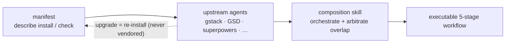

## 問題所在

AI 編程 harness —— ECC、Superpowers、GSD、gstack —— 各自以獨立的 npm 套件或 git 儲存庫形式發佈。手動把它們整合在一起很脆弱：你得 fork 上游程式碼、在本地打修補，然後眼睜睜看著它隨上游發新版而腐化。

傳統解法是 vendoring：把上游程式碼複製進你的儲存庫並自行維護。這在上游推出重大改進之前都還堪用，之後你就被困在陳舊的 fork 上，很難合併新變更。手動讓數十個 harness 元件保持同步根本不可持續。

## harnessed 的做法

harnessed 從不複製上游程式碼。每個 harness 套件提供一份**清單** —— 一個型別化的 YAML 檔，描述如何安裝該套件、它暴露哪些能力，以及如何與其他元件整合。

執行時，harnessed 讀取這些清單、驗證相容性，並透過裝配 skills 編排上游工具。你跑的永遠是官方上游二進位 —— harnessed 只負責協調各元件之間的交接。

裝配而非 vendor —— manifest 描述，composition skill 編排：



清單範例（簡化版）：

```yaml
name: my-pack
version: 1.0.0
description: 為 harnessed 加上 OAuth2 工作流
install:
  - npm: superpowers
  - git: https://github.com/example/skill-pack-oauth
capability:
  skills:
    - brainstorming
    - tdd
  workflows:
    - discuss
    - plan
```

## 優勢

**永遠跑在最新上游。** 當 Superpowers 發佈新版本時，重新執行 `harnessed install` 就能立刻取得。不必手動合併，沒有陳舊的 fork。

**經過驗證的裝配。** `harnessed setup` 在安裝前檢查清單相容性。互相衝突的能力宣告會以錯誤形式浮現，而不是變成執行時的驚喜。

**寫你自己的 pack。** 清單 schema 發佈在 repo 的 `schemas/manifest.v1.schema.json`（把 YAML language server 指向它即可行內驗證）。把你的清單指向任何可安裝的上游（npm 套件、git 儲存庫、自訂 skill），harnessed 就會把它視為一等的可裝配單元。

**統一入口點。** 使用者面對的是 `/discuss`、`/plan`、`/task`、`/verify`，不必學每個上游的術語。裝配 skill 負責在每個階段路由到正確的上游工具。

## 裝配 skills 的運作方式

自 v4.0 起，harnessed 是 **orchestration brain + prompt library**（決策大腦 + prompt 庫），不再是執行引擎。它不在自身行程內 spawn 工作流 —— 而是由斜線命令體（`harnessed setup` 產生）指揮 Claude Code main session 去 spawn **CC-native subagent**，由三個秒級純函式 CLI 驅動。當你執行 `/discuss` 時：

1. **Gate** —— `harnessed gates discuss --task "<spec>"` 回傳三個討論關卡中哪些被觸發（策略／階段／子任務），以及是否升級到 Agent Teams。
2. **Prompt** —— 對每個被觸發的關卡，`harnessed prompt <sub> --json` 輸出 spawn-ready prompt（role 主體 + checklist + 已套用的 disciplines）。
3. **Spawn** —— main session 用原生 `Task` spawn（完成承諾由 harnessed 自有閘門 `harnessed checkpoint complete` 把關），並把任何 `STATUS: NEEDS_CLARIFICATION` 透過 `AskUserQuestion` 回流給你。
4. **Checkpoint** —— `harnessed checkpoint complete <sub>` 把進度記錄到 `.planning/`，讓流程能在 compaction 之後存活。

harnessed 貢獻決策（gate 路由、prompt 生成、進度 ledger）；實際的 spawn、Agent Teams 協調、釐清往返，都由 main session 用 Claude Code 原生工具執行。（`harnessed run` 保留舊的行程內 spawn，僅供 CI／headless 使用。）

這正是 harnessed 的 29 個工作流能夠同時裝配 ECC、Superpowers、GSD 與 gstack 的原因 —— 裝配層抽象掉了各元件之間的接縫。

完整的 29 個工作流及其上游相依，請參閱[工作流參考](/zh-hant/docs/reference/workflows/)。
