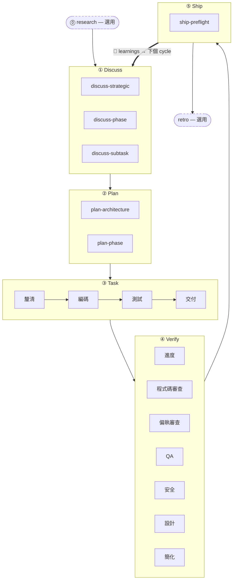

五階段節奏是 harnessed 的核心方法論：每個功能、bug 修補或重構都依相同的五個階段推進 —— **Discuss → Plan → Task → Verify → Ship** —— 由自動的 **Learn** 迴圈收尾。兩個伴生階段（Research、Retro）分別位於主迴圈兩端。

## 階段

| #   | 階段         | 斜線命令    | 模式                           |
| --- | ------------ | ----------- | ------------------------------ |
| 0   | **Research** | `/research` | 選用 —— 當理解還不清楚時觸發   |
| 1   | **Discuss**  | `/discuss`  | 必要                           |
| 2   | **Plan**     | `/plan`     | 必要                           |
| 3   | **Task**     | `/task`     | 必要                           |
| 4   | **Verify**   | `/verify`   | 必要                           |
| 5   | **Ship**     | `/ship`     | 顯式 —— 發佈階段（使用者觸發） |
| —   | **Retro**    | `/retro`    | `/auto` 中強制，單獨呼叫則選用 |

**學習是自動的，不是一個階段。** 每個完成的 workflow 會把它的 failure／loop／reject 訊號追加到 `.planning/LEARNINGS.md`；inject hook 再把相關 learnings 注入下一個 session。這是 always-on 的，**不**依賴選用的 Retro。

### Research（選用）

透過 Tavily、Exa 與 ctx7 進行多來源調研。在 `/auto` 中當你回答「否」（需求還不清楚）時觸發，或直接呼叫 `/research`。輸出寫入 `.planning/` 下的 `research-notes.md`。

### Discuss —— 三層關卡

`/discuss` 獨立評估三個關卡，只執行被觸發的那些：

- **策略層**（`discuss-strategic`）：新功能、新 milestone、新產品方向 → gstack `/office-hours` + `/plan-ceo-review`。持久化 `findings.md`。
- **階段層**（`discuss-phase`）：≥2 個未定的實作決策，跨模組資料流不清楚 → GSD `gsd-discuss-phase`。持久化 `findings.md` + `knowledge.md`。
- **子任務層**（`discuss-subtask`）：≥2 種不同方案的核心演算法／API contract → Superpowers brainstorming。短暫，不持久化。

每個關卡在觸發與跳過時都會透明宣告。

### Plan —— 架構審查 + 持久化

`/plan` 依序執行兩步：

1. **架構審查**（條件觸發）—— 複雜架構會觸發 gstack `/plan-eng-review`，在持久化之前先鎖定設計
2. **階段計畫** —— GSD `gsd-plan-phase` + planning-with-files 產生 `task_plan.md`，內含精確檔案路徑、驗收標準與相依順序

### Task —— 子任務迴圈

`/task` 嚴格依序對每個子任務執行四步：

1. **釐清** —— 驗證規格、攤開歧義、核對 `task_plan.md`
2. **編碼** —— karpathy 原則：最小可行改動、外科手術式編輯、不擴大範圍
3. **測試** —— 核心邏輯 TDD 紅燈 → 綠燈 → 重構；CRUD／顯而易見的實作則為選用
4. **交付** —— `harnessed checkpoint complete` 閘門要求逐字輸出 `COMPLETE` 後才推進

### Verify —— 7 項條件子檢查

`/verify` 依變更內容派送子檢查。一律執行：`verify-progress`（UAT + 狀態同步）、`verify-code-review`（多 agent 平行）、`verify-simplify`（最終清理）。條件執行：偏執審查、QA、安全、設計、multispec。

### Ship —— 發佈階段

`/ship` 是第 5 個階段，位於 Verify 之後。它先跑 `harnessed release-preflight`（唯讀的發佈就緒關卡 —— `CHANGELOG [Unreleased]`／version／git-clean／tag-absent），再把 PR + deploy 委派給 gstack `/ship`。**deploy 邊界 = tag-ready**：本階段不 push、不 publish、不建立 tag —— 實際的 `npm publish` + GitHub release 由 `publish.yml` CI 在 tag push 時執行（需顯式核准）。「PR ready ≠ release ready」。

### Retro

gstack `/retro` 沉澱里程碑經驗教訓、決策記錄與意外發現。在 `/auto` 中強制執行。也可在任一里程碑結束時單獨呼叫。（與上面 always-on 的 Learn 迴圈不同。）

## 流程圖



## `/auto` 與單獨的階段命令

`/auto` 自動串接核心開發階段（research 條件 → discuss → plan → task → verify → retro）。**Ship 是顯式的** —— `/auto` 不自動發版；等里程碑準備好切版時，由你自己跑 `/ship`。單獨的階段命令讓你能從任一階段切入：

```
/discuss "加上限速中介層"     # 只執行 discuss
/plan "限速中介層"            # 只執行 plan（假設 discuss 已完成）
/task "實作中介層"            # 只執行 task
/verify "限速中介層功能"      # 只執行 verify
/ship                        # 只執行 ship（release-preflight → tag-ready）
```

跨*多個* phase 時，`harnessed advance` 會從 `.planning/` 的磁碟狀態推導下一個 phase，並印出該跑的命令 —— 於是一個 driver loop 可以 hands-free 串接多個 phase（`while harnessed advance --json; do : ; done`），並在更早的 phase 未完成時停在 advance-gate。詳見 [CLI 參考](../../reference/cli/) 的 `harnessed advance` 條目。

外科手術式的子工作流呼叫則完全跳過主控：

```
/discuss-phase "..."        # 只執行階段層釐清
/plan-architecture "..."    # 只執行架構審查
/verify-paranoid "..."      # 只執行偏執工程師檢查
```

架構決策詳見 [ADR 0030](https://github.com/easyinplay/harnessed/blob/main/docs/adr/0030-namespace-policy.md)、0031、0032（命名空間設計決策）。
