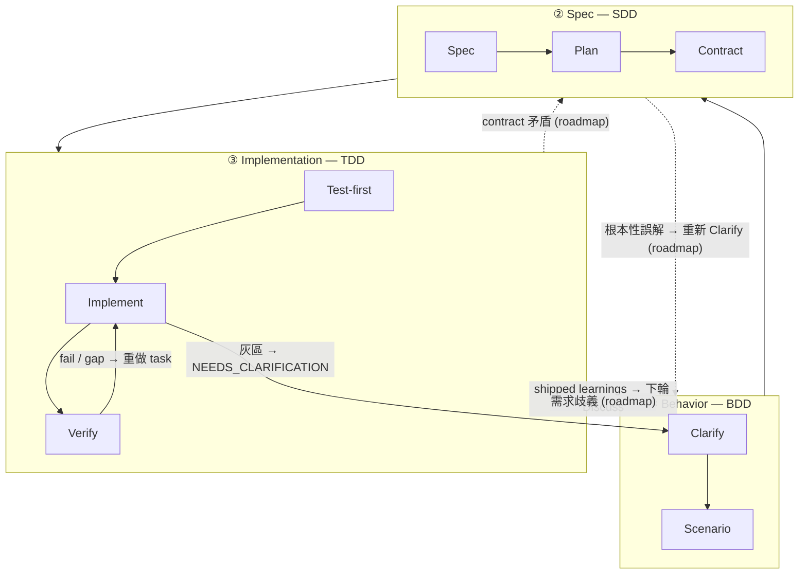

三層堆疊是 harnessed 關於「節奏*為什麼*長這樣」的理論。它是軟體工程上 **BDD → SDD → TDD** 三者的巢狀實作：三個巢狀回饋迴圈，各自回答一個不同的問題。harnessed 的貢獻是把開源生態**組合**進每個 loop —— 而由於上游元件*部分交集*，仲裁這種交集正是裝配編排器的本職工作。

## 三個迴圈

| 層                   | Loop | 回答的問題               | 由哪些元件組合（彼此交集）                                                                        |
| -------------------- | ---- | ------------------------ | ------------------------------------------------------------------------------------------------- |
| **① Behavior**       | BDD  | 做*什麼*，以及怎樣算做完 | gstack `/office-hours` governance · GSD discuss · superpowers brainstorming → acceptance criteria |
| **② Spec**           | SDD  | *怎樣*組織結構           | GSD plan-phase → requirements / design / tasks · contracts（Spec Kit / ECC patterns）             |
| **③ Implementation** | TDD  | 它是否真的*跑得通*       | superpowers TDD red-green · subagent execution · GSD verify-work · ralph-loop completion          |

**loop 是巢狀的鏡頭（nested lenses），不是階段。** Cucumber 推廣了 BDD-outer + TDD-inner 雙環：一個 failing scenario 打開外環，你透過多次內層 red-green TDD 迴圈把它推到綠。GenAI 時代加了一個中間環 —— Behavior 與 Implementation 之間顯式的 SDD **spec** 環，因為 agent 需要一份 frozen contract 才能執行。於是構成上面的**三層迴圈（triple-loop）**。

## 節點級展開

每個 loop 拆成若干節點，每個節點都標出它由哪個（些）開源元件組合而成。

### ① Behavior (BDD)

| 節點         | 作用                           | 由哪些元件組合                                                   |
| ------------ | ------------------------------ | ---------------------------------------------------------------- |
| **Clarify**  | 鎖定*做什麼* + 攤開歧義        | gstack `/office-hours` + GSD discuss + superpowers brainstorming |
| **Scenario** | 把意圖轉成 acceptance criteria | GSD phase success criteria                                       |

外環在 scenario 的 acceptance criteria 寫出來之前一直敞開。「做完」的定義在這裡確定 —— 早於任何結構或程式碼。

### ② Spec (SDD)

| 節點         | 作用                  | 由哪些元件組合                                                    |
| ------------ | --------------------- | ----------------------------------------------------------------- |
| **Spec**     | requirements + design | GSD plan-phase + Spec Kit 三件套（requirements / design / tasks） |
| **Plan**     | tasks + 相依 DAG      | GSD `PLAN.md` + ECC 分解                                          |
| **Contract** | 介面 frozen           | contract 慣例                                                     |

中間環把「做什麼」轉換成可執行的結構。它的退出條件是一份 **frozen contract** —— implementation 環將據此撰寫測試的介面。

### ③ Implementation (TDD)

| 節點           | 作用                     | 由哪些元件組合                          |
| -------------- | ------------------------ | --------------------------------------- |
| **Test-first** | failing test（red gate） | superpowers TDD                         |
| **Implement**  | 推到 green               | subagent execution                      |
| **Verify**     | refactor + 逐任務完成    | GSD verify-work + ralph-loop completion |

內環就是經典的 red → green → refactor 迴圈，每個 task 跑一遍，直到所有 contract 都被滿足。

### Cross-cutting

兩個關注點位於任一單一 loop 之外：

| 關注點     | 作用            | 由哪些元件組合                       |
| ---------- | --------------- | ------------------------------------ |
| **Review** | 品質 + 安全關卡 | gstack `/review` + `/cso`            |
| **Ship**   | 發佈就緒 + 交付 | `release-preflight` + gstack `/ship` |

另有兩個 **discipline** 貫穿*每一*層：

- **karpathy principles** —— _how_ to code：最小可行改動、外科手術式編輯、simplicity first。
- **mattpocock moves** —— 按需召喚的工具（`/zoom-out`、`/diagnose`、`/grill-with-docs`），看場景取用。

## 回轉（GoBack）

flow 預設是 outer → inner。**harnessed 是這個 triple-loop 的 linear-cadence 實作 —— 完整的 routed graph 是它的演進方向。** 這些 loop 仍是回饋迴圈，但今天只有部分回轉邊真正 ship；更細粒度的、按環路由的結構化回轉屬於 roadmap。下圖把已 ship 的邊畫成實線，roadmap 的邊畫成虛線並標 `(roadmap)`。

### 今天已 ship

目前的 linear cadence 裡有三條 live 的回轉邊：

- **Verify → Task** —— 失敗的檢查或未滿足的 gap，把失敗的工作打回 implementation 環重做。
- **灰區 → 釐清** —— subagent 撞到歧義時回傳 `STATUS: NEEDS_CLARIFICATION`；run 暫停、釐清、再繼續。
- **Learnings → 下輪 Discuss** —— 每個 shipped cycle 把 failure／loop／reject 訊號追加下來，餵回下一輪的 Behavior 環（always-on 的 learn loop）。

### Roadmap（尚未 ship）

更細粒度的結構化回轉 —— 把 gap *直接*路由到擁有答案的那個環 —— 是演進方向，而非目前行為：

- **contract 矛盾**（implementation 無法滿足一個 frozen 介面）→ 路由回 **Spec**。
- **需求歧義**（contract 內部自洽，但 behavior 本身欠規約）→ 路由回 **Behavior**。
- **根本性誤解**（整個結構瞄準了錯誤的結果）→ 重新打開 Behavior 的 **Clarify**。

今天這些 gap 是透過上面三條已 ship 的邊浮現（通常是 Verify → Task 加上人工釐清），而不是自動的按環路由。裝配編排器的近期價值在於：當不同上游元件各自擁有不同的環時，讓 linear cadence 彼此保持一致；routed graph 則是它前進的方向。

## 元件交集 —— 這正是重點

同一個上游工具會出現在不只一個 loop 裡。這種交集不是冗餘，而是裝配編排器要仲裁的介面：

- **GSD** 是 **backbone** —— 貫穿全部三個環（discuss → plan → verify）。
- **gstack** 橫跨 **Behavior + Review**。
- **superpowers** 橫跨 **Behavior**（brainstorm）+ **Implementation**（TDD）。

沒有仲裁，這些交集會重複觸發或互相矛盾。裝配層把每個環路由到正確的上游工具，並解決接縫。

## 理論 vs. runtime

三層堆疊是*理論*。[五階段節奏](/zh-hant/docs/concepts/five-stage-cadence/) 則是這套理論在命令列的運作方式：

| Loop（理論）     | runtime 階段                       |
| ---------------- | ---------------------------------- |
| ① Behavior       | **Discuss**                        |
| ② Spec           | **Plan**                           |
| ③ Implementation | **Build**（Task）                  |
| Cross-cutting    | **Verify + Ship**（evidence gate） |

關於上游工具*如何*在不 fork 的前提下拼接，參閱 [裝配主義，而非 vendoring](/zh-hant/docs/concepts/composition/)。
