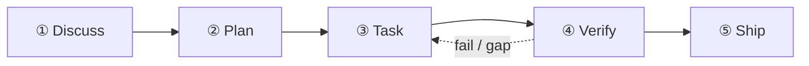

本教學透過一個真實範例，逐步演示五階段節奏：**「為我們的 Express API 加上限速中介層 —— 每 IP 每分鐘 100 次請求，Redis 後端。」**

你的第一次 `/auto` 會端到端走完五個 stage：



## 階段一 — Discuss

```
/discuss "為我們的 Express API 加上限速中介層 —— 每 IP 每分鐘 100 次請求，Redis 後端"
```

`/discuss` 平行評估三個釐清關卡，只執行被觸發的那些：

- **策略關卡**（`discuss-strategic`）：這是新功能，還是對既有基礎設施的改造？是否影響產品定位？對於限速中介層，這個關卡通常會觸發一次快速的治理檢查。
- **階段關卡**（`discuss-phase`）：是否有 ≥2 個未定的實作決策？（Redis 還是記憶體儲存？逐路由還是全域？）該關卡負責釐清並把發現持久化到 `findings.md`。
- **子任務關卡**（`discuss-subtask`）：是否有 ≥2 種不同實作方案的子任務？核心演算法設計會進行快速 brainstorming。

**產出物**：`.planning/PHASE-N/` 下的 `findings.md` 與 `knowledge.md`。

## 階段二 — Plan

```
/plan "限速中介層功能"
```

`/plan` 依序執行兩步：

1. **架構審查**（條件觸發）—— 若功能跨越模組邊界或涉及新的基礎設施，gstack 的偏執工程師會審查設計
2. **階段計畫** —— GSD 將 `task_plan.md` 持久化，內含精確的檔案路徑、驗收標準與相依順序

**產出物**：`.planning/PHASE-N/PLAN.md` 與 `task_plan.md`。

## 階段三 — Task

```
/task "實作限速中介層"
```

`/task` 每個子任務依序執行四步：

1. **釐清** —— 編碼前驗證規格，攤開歧義點
2. **編碼** —— 遵循 karpathy 原則（最小可行改動、外科手術式編輯）
3. **測試** —— 核心邏輯 TDD：紅燈 → 綠燈 → 重構
4. **交付** —— `ralph-loop` 包裝器確保輸出逐字 `COMPLETE` 後才推進

## 階段四 — Verify

```
/verify "限速中介層功能"
```

`/verify` 依變更內容派送最多 7 項子檢查：

| 檢查項               | 觸發條件                          |
| -------------------- | --------------------------------- |
| `verify-progress`    | 一律執行（UAT 驗收 + 狀態同步）   |
| `verify-code-review` | 一律執行（多 agent 平行 fan-out） |
| `verify-paranoid`    | 關鍵模組或 PR 前                  |
| `verify-qa`          | 有 UI 變更                        |
| `verify-security`    | 涉及認證或密鑰                    |
| `verify-design`      | 有設計變更                        |
| `verify-simplify`    | 一律最後執行（移除冗餘邏輯）      |

## 持久化到 `.planning/` 的產物

```
.planning/
├── STATE.md          # 目前階段／進度的事實來源
├── ROADMAP.md        # 階段路線圖
└── PHASE-1/
    ├── PLAN.md       # 任務清單、檔案路徑、驗收標準
    ├── findings.md   # Discuss 階段產出
    ├── task_plan.md  # 子任務細部拆解
    └── PROGRESS.md   # 即時進度追蹤
```

## 下一步

Verify 完成後，執行 `/retro` 收尾里程碑並沉澱經驗教訓。若使用 `/auto`，這些階段會自動串接 —— 一鍵命令路徑請參閱[快速上手](/zh-hant/docs/getting-started/quickstart/)。

每個階段背後的架構原理，請閱讀[五階段節奏](/zh-hant/docs/concepts/five-stage-cadence/)。
