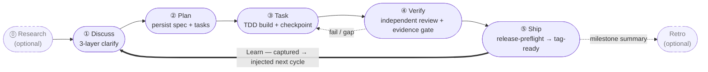

harnessed 是 AI 編程 harness 的套件管理器與裝配編排器。它透過型別化清單安裝、裝配並執行整合了 Skills、MCP 伺服器及其他 harness 套件的工作流 —— 不必 vendor 上游程式碼。

如果你正在使用 Claude Code，harnessed 會把最優秀的開源元件 —— ECC、Superpowers、GSD、gstack —— 用一條指令串成統一的可執行工作流。

運轉迴圈 —— 五個 stage 由一個 always-on 的 Learn 迴圈收尾：

## 從哪裡開始

- **[安裝](/zh-hant/docs/getting-started/installation/)** — 30 秒內安裝 harnessed 並完成初始化
- **[快速上手](/zh-hant/docs/getting-started/quickstart/)** — 60 秒內從安裝到第一個工作流
- **[裝配主義概念](/zh-hant/docs/concepts/composition/)** — harnessed 如何在不 fork 上游的情況下裝配工具
- **[工作流參考](/zh-hant/docs/reference/workflows/)** — 目前版本隨附的全部 28 個可裝配工作流

## harnessed 的差異化優勢

每個工作流都建立在三個核心理念上：

**裝配主義，而非 vendoring。** 每個 harness 套件提供一份清單。harnessed 讀取清單、驗證相容性，並在執行時把上游工具拼接起來。你跑的永遠是官方上游版本，而不是陳舊的 fork。

**內建五階段節奏。** Discuss → Plan → Task → Verify → Ship，可選 Research 與 Retro，外加自動學習迴圈。或執行 `/auto` 一條指令跑完整條六階段管線（research → retro；Ship 為顯式）。

**Dogfood 優先方法論。** 每個工作流都用自身定義來驗證 —— 這正是 harnessed 交付自己時所遵循的紀律。

完整的高層介紹請閱讀 [README](https://github.com/easyinplay/harnessed#readme)。
