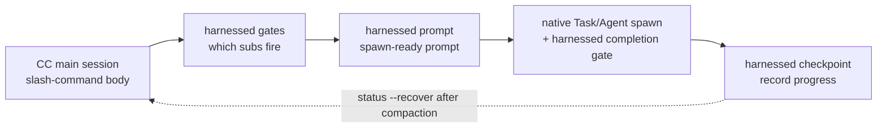

> **v4.0 執行模型。** harnessed 是 _orchestration brain + prompt library_（決策大腦 + prompt 庫），不是執行引擎。斜線命令體（由 `harnessed setup` 產生）透過三個秒級純函式 CLI 驅動 **CC-native subagent spawn** —— `harnessed gates`（哪些子工作流觸發）、`harnessed prompt`（子工作流的 spawn-ready prompt）、`harnessed checkpoint`（記錄進度）。實際的 spawn、Agent Teams、釐清往返都由 Claude Code main session 用原生工具執行。`harnessed run` 僅保留給 CI／headless 情境。

三個 orchestration CLI 如何驅動 CC-native spawn：



## `harnessed`（you-are-here 儀表板）

**不帶任何參數**跑 `harnessed` 會印出 you-are-here 儀表板 —— 在進行中的 workflow 裡重新定位最快的方式（comet `/comet` 的類比，v8.0 引入）。

```bash
harnessed          # 人類可讀的 you-are-here + 下一步 儀表板
harnessed --json   # 機器可讀的結構化物件
```

它會自動偵測目前 repo 的進行中 workflow，印出目前 phase、每個子工作流的狀態，以及單行的確定性契約 `NEXT: auto | manual | done` 加一條 run 提示（如 `→ run: harnessed prompt <sub>`）。沒有進行中的 workflow 時，會印出指向 `harnessed setup` 的入門提示。

**唯讀** —— 不 spawn、不改狀態／git／remote；一律 exit `0`。只有裸 `harnessed`（或 `harnessed --json`，可帶 `--lang`）會派送儀表板；任何子命令、`--help`、`--version` 或未知詞都會 fall through 到正常命令解析（所以 `harnessed bogus` 仍會報錯）。

`--json` 欄位：`active`、`phase`、`status`、`started_at`、`next`、`sub`、`hint`、`sub_progress`。

---

## `harnessed setup`

一鍵入門初始化 —— 把工作流 skills 與基礎清單安裝到 `~/.claude/`。

```bash
harnessed setup [選項]
```

**執行內容：**

1. 掃描 `workflows/<name>/SKILL.md`，把每個複製到 `~/.claude/skills/<name>/`
2. 處理 `manifests/tools/*.yaml` 與 `manifests/skill-packs/*.yaml`
3. 向 `~/.claude/settings.json` 寫入 `CLAUDE_CODE_EXPERIMENTAL_AGENT_TEAMS=1`
4. 偵測作業系統語言並寫入 `env.HARNESSED_USER_LANG`（zh-* → `zh-Hans`，其他 → `en`）

**參數：**

| 參數                 | 說明                                                     |
| -------------------- | -------------------------------------------------------- |
| `--user-lang <code>` | 覆寫偵測到的語言。接受 `en`、`zh-Hans`、`zh-CN`、`zh-TW` |
| `--dry-run`          | 僅預覽 —— 印出將寫入的內容，不改動磁碟                   |

**退出碼：** `0` = 成功，`1` = 檔案系統錯誤，`2` = 找不到含 SKILL.md 的工作流。

---

## `harnessed install <pack>`

依名稱或路徑安裝 harness 套件。

```bash
harnessed install <pack>
```

解析套件清單、對照 schema 驗證，然後依序執行每個 `install` 步驟。目前支援從本地路徑與 git URL 進行引導安裝；npm registry 套件探索功能已在規劃中。

---

## `harnessed install-base`

一鍵安裝整個 base profile —— `manifests/tools/*.yaml` 與 `manifests/skill-packs/*.yaml` 下的每一份清單，依排序順序執行。它是獨立子命令（而非 `install` 上的 `--base` flag），因此不會與單套件 gate 衝突。

```bash
harnessed install-base                   # 立即套用（預設）
harnessed install-base --dry-run         # 僅預覽 —— 不改動磁碟
harnessed install-base --non-interactive # 跳過所有提示（CI／腳本）
```

印出統計：`installed / already-installed / skipped (user-aborted) / failed`。

**退出碼：** `0` = 至少安裝一個且無失敗 · `1` = 有一個或多個失敗 · `2` = 什麼都沒安裝（全部 already-installed 或被中止）。

---

## `harnessed research`

跑 research workflow —— search 類別子路由 → subagent spawn → verbatim `COMPLETE`。是 `workflows/research/workflow.yaml` 的薄別名。

```bash
harnessed research --query "compare Postgres vs SQLite for this use case"
harnessed research --query "..." --dry-run          # 預覽解析出的 workflow + gate context（JSON）
harnessed research --query "..." --model sonnet      # subagent model：haiku | sonnet | opus
harnessed research --query "..." --non-interactive   # 跳過所有提示（CI／腳本）
```

| 參數                | 說明                                                                    |
| ------------------- | ----------------------------------------------------------------------- |
| `--query <text>`    | research prompt（**必填**）                                             |
| `--dry-run`         | 僅預覽 —— 印出 `{ workflow, yamlPath, gateContext }` envelope，不 spawn |
| `--model <model>`   | subagent model：`haiku` \| `sonnet` \| `opus`                           |
| `--non-interactive` | 跳過所有提示（CI／腳本）                                                |

**退出碼：** `0` = workflow 完成 · `1` = workflow 執行時失敗 · `2` = 用法錯誤（缺 `--query` 或找不到 workflow yaml）。

---

## `harnessed manifest-add <upstream>`

在 **EE-5 五問 merge gate** 之後加入一個新的上游轉接器 —— 五個互動式提問，強制在把新上游接進裝配之前做一次深思熟慮的決策（是不是可複用的 surface、名字是否合適、與既有元件是否 overlap、是 import 概念還是 import 別人的產品身份、使用者不知 upstream 是否還能理解）。五問全部必須有非空回答。

```bash
harnessed manifest-add https://github.com/owner/repo.git
harnessed manifest-add <upstream> --category tools    # skill-packs（預設）| tools
harnessed manifest-add <upstream> --name myadapter    # 預設取 <upstream> basename
harnessed manifest-add <upstream> --dry-run           # 預覽 —— 印出答案，不寫入
harnessed manifest-add <upstream> --non-interactive   # CI：WARN-only dry-run，什麼都不寫
```

成功時把答案寫入 `manifests/<category>/<name>.ee5-answers.json`。

| 參數                | 說明                                       |
| ------------------- | ------------------------------------------ |
| `--category <cat>`  | 清單類別：`skill-packs`（預設）\| `tools`  |
| `--name <name>`     | 短轉接器名（預設取 `<upstream>` basename） |
| `--dry-run`         | 僅預覽 —— 印出答案 JSON，不寫入            |
| `--non-interactive` | CI／腳本 —— WARN-only，什麼都不寫          |

**退出碼：** `0` = gate 通過（寫入或預覽）· `1` = 有答案留空。

---

## `harnessed uninstall [pack]`

解除安裝一個已安裝的套件；不帶參數時，移除 harnessed 自身安裝的檔案。

```bash
harnessed uninstall <pack>   # 移除單一套件（執行其清單的 uninstall 步驟）
harnessed uninstall          # 從 ~/.claude/ 移除 harnessed 自身的 skills／manifests
```

對三個把 skill 裝到磁碟的安裝方法（`npm-cli`、`git-clone-with-setup`、`npx-skill-installer`），uninstall 會執行清單**宣告的 `spec.uninstall` 契約**：先執行宣告的 `cmd`（fail-soft —— 非零退出或缺 shell 只警告並繼續），再對每個 `cleanup_paths` 條目做冪等 force-rm，且**限制在 `$HOME` 之內**（越出 home 子樹的路徑 hard-fail）。做 settings／plugin／MCP 手術的方法（`cc-hook-add`、`cc-plugin-marketplace`、`mcp-*-add`）保留各自的 per-method 解除安裝器。不帶參數的統一解除安裝會逆轉 `harnessed setup`。

---

## Orchestration CLI（v4.0）

這三個純函式 CLI 是產生出來的斜線命令體用來驅動 CC-native spawn 的。它們只印 JSON、自身不做 spawn —— 由 main session 編排。

### `harnessed gates <master>`

針對某個 master orchestrator（`discuss` / `plan` / `task` / `verify` / `auto`）與任務 spec，評估哪些子工作流會觸發。

```bash
harnessed gates plan --task "add OAuth login" --skip-sub discuss
# → JSON: { fire: [{ sub, order, mode }], skip: [...], parallelism: { escalate_to_teams } }
```

`fire` 列出通過判據 gate 的子工作流（依執行順序）；`parallelism.escalate_to_teams` 表示何時改用 CC-native Agent Teams 而非序列 subagent spawn。

### `harnessed prompt <sub>`

為單一子工作流輸出 spawn-ready prompt —— role-prompt 主體 + checklist + 已套用的 disciplines。

```bash
harnessed prompt plan-phase --task "add OAuth login" --json
# → JSON: { prompt, max_iterations, model }
```

main session 把 `prompt` 餵給原生 `Task` spawn（外層套 `harnessed checkpoint complete`）；`max_iterations` / `model` 直接取自工作流預設值。

### `harnessed checkpoint`

把子工作流進度記錄到 harnessed checkpoint store。main session 在每個子工作流完成（及失敗）後呼叫，讓 compaction 之後可用 `harnessed status --recover` 復原。

```bash
harnessed checkpoint start <master> --plan <json>   # 播種進度 ledger
harnessed checkpoint complete <sub>                 # 標記子工作流完成（帶 evidence guard）
harnessed checkpoint fail <sub>                      # 記錄失敗的子工作流
```

### `harnessed run`

**僅 CI／headless。** 在行程內以 SDK spawn 整條工作流 —— 用於沒有可編排的互動式 main session 時。v4.0 的預設路徑是上面的 gates → prompt → checkpoint 編排；`run` 是 fallback。

```bash
harnessed run <master> --task "<spec>"
```

---

## `harnessed doctor`

診斷本機 harnessed + Claude Code 安裝 —— 23 項健康檢查（Node、MCP scope 與伺服器（tavily/exa）、jq、bun、Windows bash 類型、origin URL、gstack prefix、已棄用 manifest、token budget、Agent Teams env、planning-with-files、mattpocock-skills、CodeGraph、GateGuard 衝突、工作流 skill 完整性、update、安裝通道、過時 hook、ECC、每回合注入配對、外掛安裝新鮮度、`HARNESSED_OFF` 消融開關）。`HARNESSED_OFF=1` 讓 harnessed 所有常駐 hook 變為空操作（A/B 對照時無需解除安裝即可得到乾淨的對照組）；設定期間 doctor 會給出警告。

```bash
harnessed doctor
harnessed doctor --json   # 機器可讀報告
```

---

## `harnessed update`

保持 harnessed（及可選的上游外掛）最新。doctor 的 update 檢查也會被動提示 "update available X→Y"。`update` 是雙通道的 —— 自動偵測 harnessed 的安裝方式並走對應流程。

```bash
harnessed update                      # 自我升級 + CHANGELOG 頂部小節 + 重啟提示
harnessed update --check              # 只回報 installed／latest 版本，不安裝
harnessed update --dry-run            # 預覽將執行的更新動作 —— 不寫任何東西
harnessed update --upstreams          # 額外重跑 base manifests 升級上游外掛
harnessed update --migration-report   # 唯讀盤點 stale harnessed 狀態（不刪除任何東西）
harnessed update --rollback [version] # 僅 compiled 二進位 —— 還原 bin-backup/ 中留存的舊版
```

**npm 通道** —— 執行 `npm i -g harnessed@latest`，印出 CHANGELOG 頂部小節，並提醒重啟 Claude Code。

**Compiled 二進位通道**（一行安裝器）—— 從 GitHub releases 下載平台資產，校驗 `.sha256` 檢查碼**及其 ed25519 簽章**（`<asset>.sha256.sig`，自 v4.32.19 起為發佈契約 —— 簽章缺失或驗簽失敗均為 hard error，當前二進位原封不動），隨後原子換入新二進位；被換下的舊版存入 `bin-backup/` 供回滾。

**`--rollback [version]`**（僅 compiled 二進位）—— 從 `bin-backup/` 原子還原舊版：預設取最新留存版本，也可指定版本（未知版本會報錯並列出可用版本）。當前二進位會先存回 bin-backup，因此回滾本身可逆。npm 安裝模式下會拒絕並導向 `npm i -g harnessed@<version>`。

網路存取 fail-soft —— npm 不可達時絕不報錯。

---

## `harnessed release-preflight`

Ship 階段的關卡。**唯讀**的發佈就緒檢查 —— repo 未就緒發版則 exit 1。不改任何東西（實際 publish 由 CI 在 tag push 時執行）。

```bash
harnessed release-preflight
```

檢查項：`CHANGELOG.md` 的 `[Unreleased]`（或 `[<version>]` 段）非空、`package.json` 有合法 version、工作樹乾淨（tracked 改動）、`v<version>` tag 尚未存在。

---

## `harnessed compact`

總結＋驅逐已解決的 sub-progress ledger 條目，為長任務釋放上下文。**G6-safe**：`fail_count > 0` 的條目永不驅逐，break-loop 訊號得以保留。

```bash
harnessed compact                                  # 手動 compaction
harnessed checkpoint complete <sub> --tokens <n>   # token 數越過閾值時自動觸發
```

---

## `harnessed workflows`

列出進行中的 workflow —— 每個 repo 一個（harnessed 依 repo root 給 checkpoint 狀態分槽，並行專案不再互相覆蓋）。

```bash
harnessed workflows
```

---

## `harnessed learn`

向目前 repo 的 `.planning/LEARNINGS.md` 追加一條 prose learning。完成的 workflow 也會自動追加其 failure／loop／reject 訊號；inject hook 再把相關 learnings 注入下一個 session。

```bash
harnessed learn "別盲目重試遷移 —— 它需要先拿一份乾淨快照"
```

---

## `harnessed retro`

重設 retro-cadence 提醒。`/retro` 是 gstack skill，harnessed 觀察不到，所以跑完它之後，呼叫 `harnessed retro --done` 把每個 repo 的 phase 計數器歸零並清除 `RETRO-DUE` inject 提醒。

```bash
harnessed retro --done   # 重設 phase 計數器 + 清除 RETRO-DUE 提醒
```

不帶 `--done` 時它什麼都不做並 exit `1`（`nothing to do — pass --done after running /retro`）。

---

## `harnessed next`

印出確定性的 next-step 契約 —— 唯讀，不修改狀態。兩層：

1. **workflow 進行中**（仍有 sub 待處理）→ 沿用 workflow 內契約 `NEXT: auto <sub> | manual <sub> | done`（exit `0`，不變）。
2. **subs 全部 resolved** → fall-through 到**跨 unit 橫向續作**（v4.10）：從 `.planning/` 磁碟 SoT 推導下一個 work unit（下一 phase／task），印出 `NEXT: advance | blocked | done`。

```bash
harnessed next
# 進行中：      NEXT: auto <sub>
# fall-through: NEXT: advance
#               UNIT: phase 16 'rate limiter'
#               HINT: run /auto (or harnessed advance) to start it — 2 phases remain
```

**跨 unit 退出碼：** `0` = advance（有下一個 unit）· `2` = done（所有 phase 完成）· `10` = blocked（需人工決策）。

---

## `harnessed advance`

推進到從 `.planning/` 磁碟 SoT 推導出的下一個 work unit —— **print-only（只印出）**。它印出下一個 phase／task 以及該跑的命令（如 `→ run /auto "..."`），但**不** seed 狀態、**不** spawn；由 main session 自己跑印出來的命令，從而保留釐清往返與 Agent Teams。

```bash
harnessed advance
# ADVANCE: advance
# UNIT: phase 16 'rate limiter'
# → run /auto "phase 16 'rate limiter'"
```

**advance-gate。** `advance` 拒絕越過更早的*未完成* phase（「comet」gate）：若推導出的下一個 phase 排序早於 workflow pointer，或有失敗的 sub 卡住 ledger，它會非零退出且**不**印出 run 命令。加 `--force` 覆寫 —— 會在輸出裡記一條 audit note 然後繼續。

```bash
harnessed advance --force   # 覆寫 gate（記錄 audit note）
```

**driver loop。** `--json` 輸出機器可讀的 `{ next, unit, hint }`，讓 shell 迴圈 hands-free 串接多個 phase —— 迴圈在任何非零退出時停止（done／blocked／gate-reject）：

```bash
while harnessed advance --json; do : ; done
```

**退出碼：** `0` = advance · `2` = done（所有 phase 完成）· `10` = blocked · `11` = gate-reject（更早的 phase 未完成；用 `--force`）· `1` = error。

**設計 —— 從磁碟推導，不維護佇列。** 「下一個」永遠從磁碟推導，絕不來自儲存的佇列。一個 phase 算完成 ⇔ 每個 `NN-*-PLAN.md` 都有對應的 `NN-*-SUMMARY.md`（artifact-derived，所以已 ship 的 phase 天生被跳過）。中途插入 phase（改 `ROADMAP.md` 或加 `phases/16.1-*/`），下一次 `advance` 會自動撿起。phase 級續作是 shipped floor；task 級 resolution 已 resolver-ready 但尚未接上 CLI。

---

## `harnessed reject <sub>`

把某個 sub-workflow 標記為使用者拒絕 —— 終態，有別於 `failed`（`failed` 會驅動 break-loop 重試邏輯）。

```bash
harnessed reject <sub>
```

---

## `harnessed resume`

從上次成功的階段續跑失敗的 `/auto` 管線。

```bash
harnessed resume
```

讀取 `.planning/STATE.md` 找到上次成功的階段，從該處重新進入管線。適用於階段中途失敗的情況。

---

## `harnessed status`

顯示目前工作目錄的管線狀態。

```bash
harnessed status
```

讀取 `.planning/STATE.md`，印出目前階段、上次完成的階段以及所有阻塞項。

```bash
harnessed status --recover
```

`--recover` 讀取 checkpoint 進度 ledger（而非 STATE.md），印出結構化的 compaction 後復原視圖 —— 已完成／待執行／已跳過的子工作流、下一條要跑的命令、以及任何 evidence-drift 警告。用於 context compaction 之後重新定位。

---

## `harnessed audit`

對 `manifests/tools/` 與 `manifests/skill-packs/` 下的清單做二線自我一致性稽核。這是縱深防禦的一道 pass，抓 Ajv schema 抓不到的 schema drift、佔位值與竄改。

```bash
harnessed audit                 # 清單 + 執行時兩層
harnessed audit --skip-runtime  # 僅清單層檢查（離線／未初始化）
```

**清單層：** repository URL 形狀（`https://…​.git`）、`signed_by` 佔位值（`unsigned` / `todo` / `tbd` / …），以及移動中的 `git_ref`（`HEAD` / `main` / `master` —— 屬 _error_：應 pin 到 SHA 或 tag）。**執行時層**（`--skip-runtime` 跳過）：origin-URL 竄改、`install.cmd` shell 注入 + npm 套件交叉核對、provenance gate。印出逐清單的 `✓ / ⚠ / ✗` 報告與 finding 統計。

**退出碼：** `0` = 無 error 級 finding（允許 warning）· `1` = 有一個或多個 error。

> **`audit` vs `audit-log`** —— `audit` *校驗清單檔案*的完整性；`audit-log`（下面）*查詢*已經發生過的路由／安裝*紀錄*。兩者關注點不同。

---

## `harnessed audit-log`

檢視路由／安裝稽核紀錄 —— 哪些 gate 觸發、哪些套件安裝、何時。

```bash
harnessed audit-log                    # 人類可讀 5 欄表格
harnessed audit-log --filter <pack>    # 依套件／事件過濾
harnessed audit-log --json             # 完整 12 欄位紀錄
```

---

## `harnessed backup list`

列出 `.harnessed-backup/` 下的每個備份快照 —— 每個快照一行，含時間戳記、來源清單與檔案數。從每個快照的 `metadata.json` 讀取。

```bash
harnessed backup list
```

與 `harnessed gc`（刪除舊快照）和 `harnessed rollback`（從選定時間戳記還原）互為姊妹命令。

---

## `harnessed gc`

回收 install／uninstall／rollback 產生的陳舊備份。

```bash
harnessed gc
```

---

## `harnessed rollback`

從最近一次備份還原上一個狀態（保留 CRLF／LF）—— 撤銷上一次 install／setup 改動。

```bash
harnessed rollback
```

---

## `harnessed check-docs`

`.planning/` 的文件紀律閘門 —— STATE.md 摘要行數上限（預設 100 行）、歸檔節奏、ROADMAP 只放指標不內嵌敘事。存在阻斷性違規時結束碼 `2`，只有提示性問題時為 `1`。

```bash
harnessed check-docs                       # 人類可讀報告
harnessed check-docs --json                # 機器可讀
harnessed check-docs --max-state-lines 120 # 調高 STATE.md 行數上限
harnessed check-docs --hook                # PreToolUse 模式：只攔截 `git commit`
```

---

## `harnessed facts <master>`

列出某個 master 實際使用的 gate facts —— 可確定的已自動填好，需要判斷的留為 `null` 並附一行提示。補齊後把檔案交給 `harnessed gates --context-file`。

```bash
harnessed facts verify --out facts.json
harnessed gates verify --context-file facts.json
```

---

## `harnessed eval`

執行編排行為回歸 trap 套件：錄製好的情境對照 golden 做確定性重播，作為 CI 閘門。

```bash
harnessed eval                     # 執行 ./fixtures/eval
harnessed eval --filter <substr>   # 只跑名稱或目錄相符的情境
harnessed eval --coverage          # judgments trigger 覆蓋矩陣
harnessed eval --update-golden     # 重新錄製 golden —— 審閱印出的 diff
harnessed eval record              # 把一次真實執行軌跡變成可重播情境
```

---

## `harnessed exempt-gateguard`

把 `GATEGUARD_EXEMPT_GLOBS=".planning/**"` 持久化到 harness settings env（先備份、原子寫入），解決 ECC 的 GateGuard hook 與 harnessed evidence guard 的雙守衛衝突；doctor 的 GateGuard 檢查會指向這裡。

```bash
harnessed exempt-gateguard
```

---

## Hook 入口（內部）

`harnessed inject-state` 與 `harnessed stop-hook` 由 `harnessed setup` 註冊的 hook 呼叫，不需要手動執行。`inject-state` 輸出每回合的 `<workflow-state>` 區塊（`--invalidate` 在 SessionStart 時清除本工作階段的上下文快取）；`stop-hook` 在回合結束時自動修復損壞的工具呼叫輸出。編譯版二進位直接註冊這兩個子命令，hook 不依賴宿主 Node。

---

## `harnessed --version`

```bash
harnessed --version
# → 4.43.0
```

---

## `harnessed --help`

```bash
harnessed --help
harnessed <command> --help   # 各命令的說明訊息
```

---

## 全域參數

| 參數        | 說明           |
| ----------- | -------------- |
| `--version` | 印出版本並退出 |
| `--help`    | 印出說明並退出 |

原始碼位於 [harnessed 儲存庫](https://github.com/easyinplay/harnessed/tree/main/src/cli) 的 `src/cli.ts` 與 `src/cli/`。
