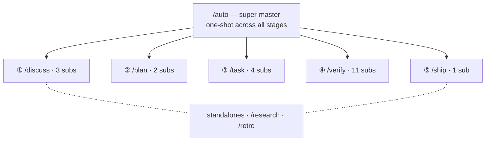

harnessed 提供 29 個依命名空間分層的工作流：一個超級主控、五個階段主控（Discuss · Plan · Task · Verify · Ship）、21 個子工作流與兩個獨立工作流。

29 個工作流 —— 一個超級主控扇出到五個 stage 主控及其 sub，外加兩個獨立工作流：

## 超級主控

| 命令    | 範圍     | 能力                                                                                                                                                                                          |
| ------- | -------- | --------------------------------------------------------------------------------------------------------------------------------------------------------------------------------------------- |
| `/auto` | 超級主控 | 完整六階段管線：research（條件觸發）→ discuss → plan → task → verify → retro（強制）。AI 一鍵複雜度評估 + 理解確認。`--staged` 旗標啟用階段關卡 UX。失敗時快速停止，`harnessed resume` 續跑。 |

## 獨立工作流

| 命令        | 範圍 | 能力                                                                                                                 |
| ----------- | ---- | -------------------------------------------------------------------------------------------------------------------- |
| `/research` | 獨立 | 透過 Tavily、Exa MCP、ctx7 進行多來源調研。在 `/auto` 中作為第 0 階段觸發，或直接在 discuss 之前呼叫。               |
| `/retro`    | 獨立 | 透過 gstack `/retro` 進行里程碑收尾總結。沉澱經驗教訓、決策記錄與意外發現到 `RETROSPECTIVE.md`。`/auto` 中強制執行。 |

## Discuss 階段

| 命令                 | 範圍     | 能力                                                                                                              |
| -------------------- | -------- | ----------------------------------------------------------------------------------------------------------------- |
| `/discuss`           | 階段主控 | 平行評估全部三個討論關卡，只執行被觸發的那些。                                                                    |
| `/discuss-strategic` | 子工作流 | 策略層 —— 新功能／milestone／產品方向。gstack `/office-hours` + `/plan-ceo-review`。持久化 `findings.md`。        |
| `/discuss-phase`     | 子工作流 | 階段層 —— ≥2 個未定決策，灰色地帶釐清。GSD `gsd-discuss-phase`。持久化 `findings.md` + `knowledge.md`。           |
| `/discuss-subtask`   | 子工作流 | 子任務層 —— ≥2 種方案／核心演算法／API contract。Superpowers brainstorming + `/grill-with-docs`。短暫，不持久化。 |

## Plan 階段

| 命令                 | 範圍     | 能力                                                                                            |
| -------------------- | -------- | ----------------------------------------------------------------------------------------------- |
| `/plan`              | 階段主控 | 依序：架構審查（條件觸發）→ 階段計畫（一律執行）。                                              |
| `/plan-architecture` | 子工作流 | 架構層 —— 複雜架構治理關卡。gstack `/plan-eng-review`。在計畫前鎖定設計。                       |
| `/plan-phase`        | 子工作流 | 階段計畫 —— GSD `gsd-plan-phase` + planning-with-files。持久化 `task_plan.md` + `progress.md`。 |

## Task 階段

| 命令            | 範圍     | 能力                                                                                                                           |
| --------------- | -------- | ------------------------------------------------------------------------------------------------------------------------------ |
| `/task`         | 階段主控 | 每個子任務的序列迴圈：釐清 → 編碼 → 測試 → 交付。                                                                              |
| `/task-clarify` | 子工作流 | 啟動釐清關卡。Superpowers brainstorming + `/grill-with-docs` 條件觸發。                                                        |
| `/task-code`    | 子工作流 | 遵循 karpathy 四原則編碼。`/zoom-out`／`/improve-codebase-architecture`／`/diagnose` 條件觸發。跨 session `progress.md` 同步。 |
| `/task-test`    | 子工作流 | TDD 紅燈 → 綠燈 → 重構。Superpowers TDD + `/diagnose` 條件觸發。核心邏輯強制。                                                 |
| `/task-deliver` | 子工作流 | harnessed 自有完成閘門(`harnessed checkpoint complete`)。執行到逐字輸出 `COMPLETE` 為止。全端協調時條件觸發 Agent Teams。                                      |

## Verify 階段

| 命令                     | 範圍     | 能力                                                                                                                              |
| ------------------------ | -------- | --------------------------------------------------------------------------------------------------------------------------------- |
| `/verify`                | 階段主控 | 依場景旗標派送最多 11 項子檢查。                                                                                                   |
| `/verify-progress`       | 子工作流 | 一律第一個執行。UAT 驗收標準檢查 + GSD 狀態同步。                                                                                 |
| `/verify-code-review`    | 子工作流 | 多 subagent 平行 fan-out。高信心度發現。                                                                                          |
| `/verify-paranoid`       | 子工作流 | 透過 gstack `/review` 進行偏執工程師審查。關鍵模組 PR 前強制。                                                                    |
| `/verify-qa`             | 子工作流 | 透過 gstack `/qa` + playwright-cli／`@playwright/test` 進行端到端 QA。有 UI 變更時觸發。                                          |
| `/verify-security`       | 子工作流 | 透過 gstack `/cso` 進行 OWASP／認證／密鑰檢查。涉及認證或密鑰時觸發。                                                             |
| `/verify-design`         | 子工作流 | 透過 gstack `/design-review` + ui-ux-pro-max + design-taste-frontend 進行設計系統一致性檢查。有設計變更時觸發。                   |
| `/verify-eval-review`    | 子工作流 | 透過 GSD `/gsd-eval-review` 進行 AI 階段 eval 覆蓋率稽核。階段含 AI／LLM 階段時觸發（與 plan 側 gsd-ai-integration-phase 配對）。 |
| `/verify-validate-phase` | 子工作流 | 透過 GSD `/gsd-validate-phase` 進行 Nyquist 需求→測試覆蓋率回填。需要覆蓋率稽核時觸發。                                           |
| `/verify-second-opinion`  | 子工作流     | 對上一個 release tag 以來的 diff 做跨模型第二意見。當改動觸及引擎真正讀取的面時觸發。                                                              |
| `/verify-simplify`       | 子工作流 | 透過 `code-simplifier` 進行最終簡化。一律最後執行。                                                                               |
| `/verify-multispec`      | 子工作流 | 四專家 Agent Team Pattern C —— 互相 SendMessage 交叉審查。關鍵發佈／大規模重構 PR 的升級路徑。                                    |

## 紀律包裝器

| 命令   | 範圍   | 能力                                                                               |
| ------ | ------ | ---------------------------------------------------------------------------------- |
| `/tdd` | 紀律   | Red → green → refactor。裝配上游 `superpowers:test-driven-development`(mattpocock `/tdd` 為備選)。 |

完成承諾不再依賴上游包裝器:自 4.36.0 起由 harnessed 自有閘門 `harnessed checkpoint complete ` 承擔(ADR 0039),因此 `/ralph-loop` 與舊的 `/execute-task` 入口已移除。

所有工作流定義位於 [harnessed 儲存庫](https://github.com/easyinplay/harnessed) 的 `workflows/<name>/workflow.yaml`。
